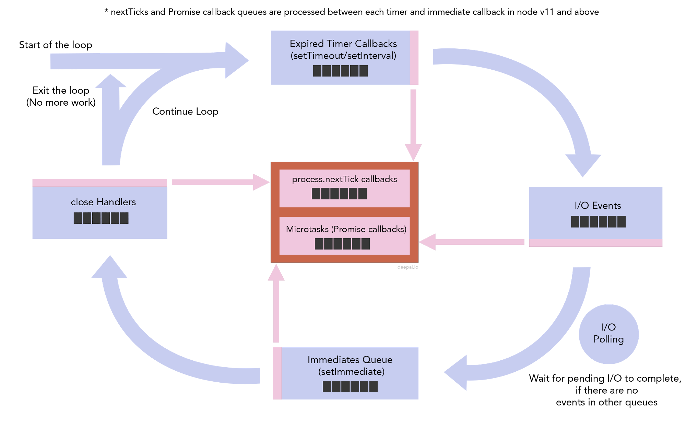

## epoll event loop
## libuv/libev/libevent memcache/redis/chrome

```js
setTimeout(() => console.log('set timeout1'), 0);
Promise.resolve().then(() => console.log('promise1 resolved'));
Promise.resolve().then(() => {
    console.log('promise2 resolved');
    process.nextTick(() => console.log('next tick inside promise resolve handler'));
});
Promise.resolve().then(() => console.log('promise3 resolved'));
setImmediate(() => console.log('set immediate1'));
process.nextTick(() => console.log('next tick1'));
setImmediate(() => console.log('set immediate2'));
process.nextTick(() => console.log('next tick2'));
Promise.resolve().then(() => console.log('promise4 resolved'));
setTimeout(() => {
    console.log('set timeout2');
    process.nextTick(() => console.log('next tick inside timmer handler'));
}, 0);
```

- 如上图所示，整个执行程序是个loop，用户代码执行会是第一次循环，将promise callback和process.nextTick加入到各自的队列中，这2类叫做micro task，将会在每次libuv的loop执行前执行。
- [promise和nextTick执行顺序是nextTick具有更高优先级](https://github.com/nodejs/node/blob/8c4b8b201ada6b76d5306c9c7f352e45087fb4a9/lib/internal/process/task_queues.js#L67)。接下来进入libuv的loop，[详情见官方文档专门解释](https://nodejs.org/en/docs/guides/event-loop-timers-and-nexttick/)。
- **promise和nextTick如上图所示将会不仅在libuv的loop每个阶段后执行，而且在timers、check阶段的每个callback执行后都会执行，后者实在v11修改的，为了保持在浏览器中行为一致性**